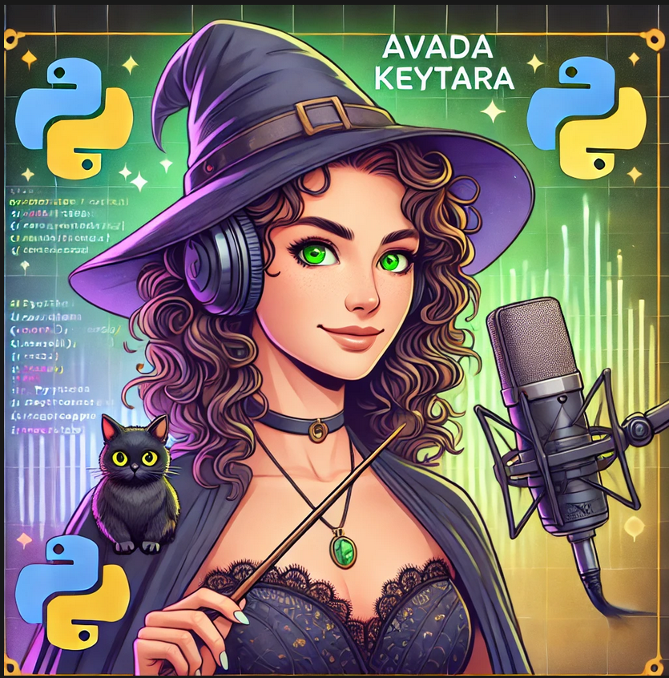

    preview do podcast

    <audio src="output/podcast_editado.MP3" controls title="Podcast editado"></audio>

# Projeto Podcast Gerado por I.A.s

Projeto com o objetivo de gerar um podcast utilizando ferramentas de IA através de prompts mais trabalhado.

Podcast inserido em "Output"

## 💻 Tecnologias utilizadas no projeto

- [ChatGPT](https://chat.openai.com/) 
- [ElevenLabs](https://beta.elevenlabs.io/)
- [Capcut](https://www.capcut.com/pt-br/)

## ✨ Como foi feito ?

- Roteiro gerado via chatgpt
- Audio gerado pela elevenLabs
- chatgpt Para gerar capas
- Capcut para tratar aúdio e adicionar sons de fundo

## 📚 Materiais

- [Link da live no Youtube](https://www.youtube.com)
- [Notion Template](https://helpful-jump-17b.notion.site/PAS-Podcast-AI-Studio-210489e15d7a4a73b743bb159e45d06f?pvs=4)
- [Editor de aúdio](https://www.capcut.com/editor?from_page=landing_page&__action_from=picture_V%C3%ADdeos%20profissionais%20em%20minutos,%20n%C3%A3o%20em%20horas.)

##🧠 Prompts

ChatGPT：

Ação 	prompt
título:	    Você é um roteirista de podcast, e vamos criar um podcast de tecnologia focado em Python, e eu gostaria de uma ajuda sua para criar cinco sugestões de nomes criativos para um podcast Python feito por mulheres nerds. Então, imagina que são nerds e que tenham um trocadilho de nome nerd.
O nome deve ser enxuto. Um nome e um subtítulo. Outra coisa que eu quero é que o nome tenha algum trocadilho nerd com nomes de franquias conhecidas como Harry Potter. Não quero que o nome contenha palavras em inglês Não quero que você utilize a palavra e nem utilize a palavra developer.

conteúdo: 	Você é um roteirista de podcast e vamos criar um roteiro de um podcast de tecnologia, focado em python cujo nome é "Avada Keytara - Matando dúvidas com Python e muito bom humor nerd" e tem foco em desenvolvimento com python por mulheres, com público alvo iniciantes em python.

Capa:    crie uma capa para esse podcast com a desenvolvedora com cabelos cacheados e olhos verdes, vestida de bruxa e com um microfone narrando o podcast.
